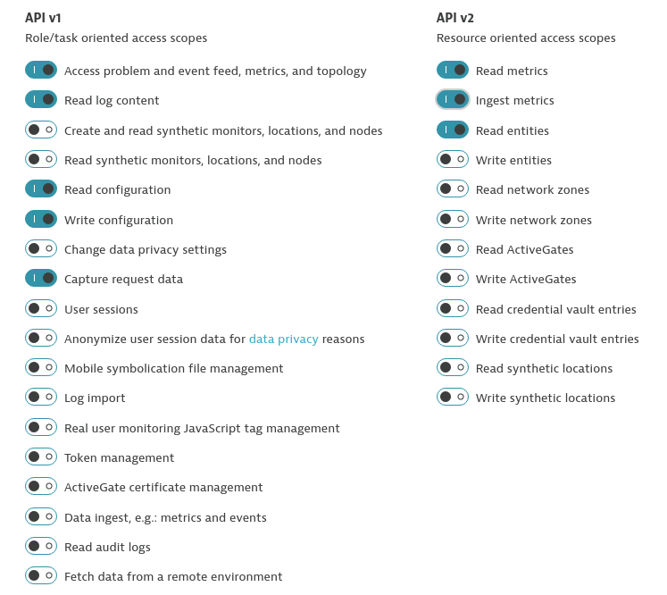
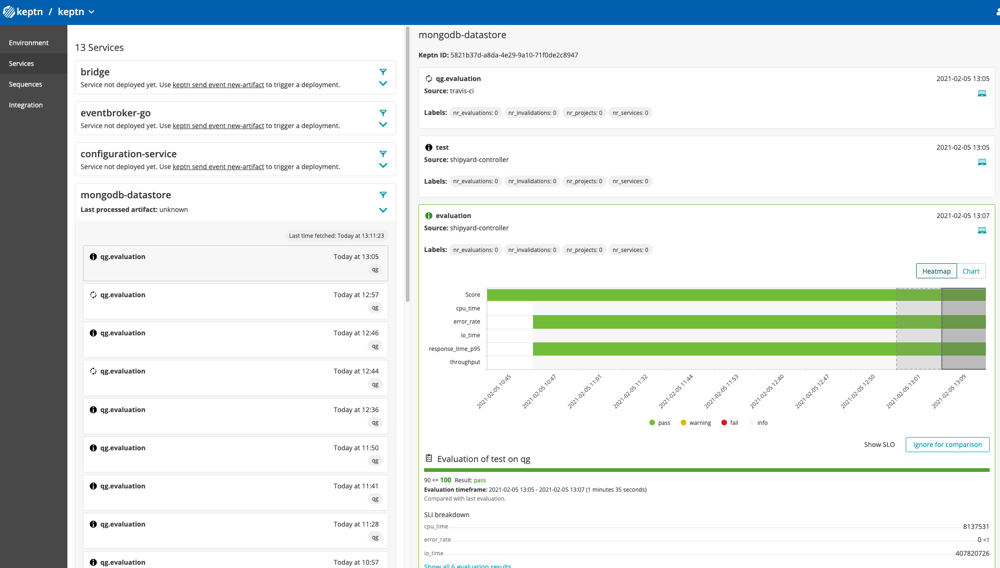

# Keptn self-monitoring with Dynatrace

This repository contains tutorials and scripts for setting up self-monitoring of [Keptn](https://keptn.sh/) with [Dynatrace](https://www.dynatrace.com/).
At the end of this tutorial, you will have set up Keptn as a project within Keptn, and have its services monitored by Dynatrace. As a result, it will be possible to use the [keptncontrib/dynatrace-sli-service](https://github.com/keptn-contrib/dynatrace-sli-service) to fetch metrics from the Dynatrace API and evaluate them using Keptn's quality-gates feature.

The tutorials and scripts in this repository are based on Keptn v0.8.0, which is currently under development and is prone to change.


## Setting up the Dynatrace Tenant

To set up the Dynatrace tenant for monitoring Keptn, please follow the following steps:

### Automatic Tagging rules

To correctly apply the filters used for the retrieval of metrics of the Keptn services, we rely on the automatically applied tags `keptn_selfmon`
 and `keptn_selfmon_service`. To create those, go to the **Settings > Tags > Automatically applied tags** menu in your Dynatrace tenant and crate them using the following rules:
 
 **keptn_selfmon**
 
 
 **keptn_selfmon_service**
 
 
 ### Service naming rules
 
 As you can see in the screenshots above, the naming of the services is not ideal, since the services show up as e.g. `default web request` or by their port numbers. To fix that, go to
 **Settings > Server-side service monitoring > Service naming rules**, and create the rule **keptn service naming**:
 
 
 
### API Token

Finally, to complete the setup of your DT tenant, you will need to create an API Token to enable Keptn to communicate with your tenant. To do so, go to **Settings > Integration > Dynatrace API **, and create a new token with the following permissions:


  
 
## Setting up Keptn as a project in Keptn

With Keptn 0.8.0 installed, you can use the script `setup-keptn-project.sh` located in this repository:

```console
export DT_TENANT=https://<dt-tenant-id>.live.dynatrace.com
export DT_API_TOKEN=<your_dt_api_token>
cd scripts
./setup-keptn-project.sh
``` 

This script will create a project called **keptn** within your Keptn installation, and create a service entity for each of the core services of Keptn. When the script 
has been executed successfully, you can either use the CLI to verify the creation of the project:

```console
$ keptn get project keptn

NAME            CREATION DATE                   SHIPYARD VERSION
keptn           2021-02-05T10:43:18+01:00       spec.keptn.sh/0.2.0
```

```console
$ keptn get service --project=keptn
NAME                    PROJECT         STAGE           CREATION DATE
bridge                  keptn           qg              2021-02-05T10:43:21+01:00
eventbroker-go          keptn           qg              2021-02-05T10:43:22+01:00
configuration-service   keptn           qg              2021-02-05T10:43:24+01:00
mongodb-datastore       keptn           qg              2021-02-05T10:43:25+01:00
gatekeeper-service      keptn           qg              2021-02-05T10:43:27+01:00
remediation-service     keptn           qg              2021-02-05T10:43:28+01:00
lighthouse-service      keptn           qg              2021-02-05T10:43:30+01:00
statistics-service      keptn           qg              2021-02-05T10:43:32+01:00
dynatrace-sli-service   keptn           qg              2021-02-05T10:43:35+01:00
jmeter-service          keptn           qg              2021-02-05T10:43:36+01:00
dynatrace-service       keptn           qg              2021-02-05T10:43:38+01:00
api-service             keptn           qg              2021-02-05T10:43:39+01:00
api-gateway-nginx       keptn           qg              2021-02-05T10:43:41+01:00
```

or you can go to your Keptn's Bridge and see what has been created:


## Evaluating Keptn using Keptn quality gates

Now that everything has been set up, you can use the script `evaluate-services.sh` to perform a load test and evaluate the quality gates that have been defined
in `scripts/assets/slo.yaml`. Note: currently, only the **mongodb-datastore** is being tested and evaluated, but the goal is to add more and more tests for each of the services.

This script will trigger the execution of an evaluation task sequence defined in the `scripts/assets/shipyard.yaml` file:

```yaml
apiVersion: "spec.keptn.sh/0.2.0"
kind: "Shipyard"
metadata:
  name: "shipyard-quality-gates"
spec:
  stages:
    - name: "qg"
      sequences:
        - name: "evaluation"
          tasks:
            - name: "test"
              properties:
                teststrategy: "performance"
            - name: "evaluation"
```

The **evaluation** sequence consists of a **test** tasks, and an **evaluation** task. The **test** task will be executed by Keptn's **jmeter-service**, which also supports the 
[Jmeter Dynatrace OSS plugin](https://github.com/dynatrace-oss/jmeter-dynatrace-plugin). This plugin enables Jmeter to use Dynatrace's [metrics ingest API](https://www.dynatrace.com/support/help/how-to-use-dynatrace/metrics/metric-ingestion/)
to push Jmeter metrics to your DT tenant and make them available as metrics via DTs API.

To execute the task sequence, please execute:

```console
cd scripts
./evaluate_services.sh
``` 

After the script has been started, you can use the Keptn's Bridge to follow the execution of the triggered evaluation task sequence:



As you can see in the screenshot, you will get an overview of all evaluated SLOs of the mongodb-datastore. To gain further insights, you can then use your Dynatrace tenant to, 
e.g. create a custom dashboard to track metrics such as the response time of the service, or the Jmeter metrics pushed to your tenant during the test execution of the jmeter service.

To do so, go to the **Dashboard** menu in Dynatrace, create a new Dashboard, and add a custom chart.
When editing the custom chart, you will get the following prompt at the top of the screen:

"Analyze multidimensional metrics from Prometheus, StatsD and others channels right on your dashboards"

After confirming this option by clicking on **"Try it out"**, you will be able to use the metrics jmeter pushed to the Dynatrace API, such as in the example below:


The chart created in this example is a multidimensional chart showing the response time, the number of requests sent by jmeter, as well as the number of errors that occurred on the mongodb datastore.
This can be useful, for example, if you would like to investigate how the number of incoming requests will affect the response time of the mongodb-datastore.

This is of course a simple example, but hopefully you got a good impression of how you as a Keptn developer can set up Dynatrace to monitor Keptn and continuously have a close eye on how Keptn is performing as we go. 

